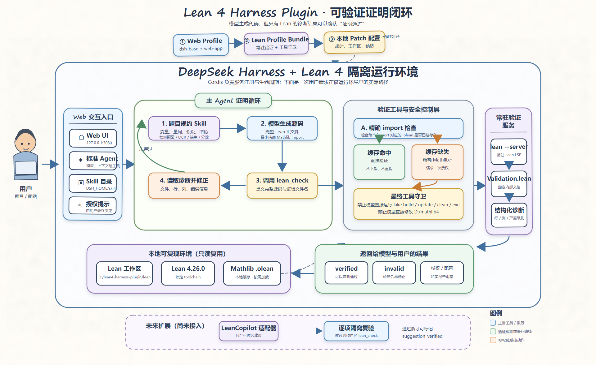
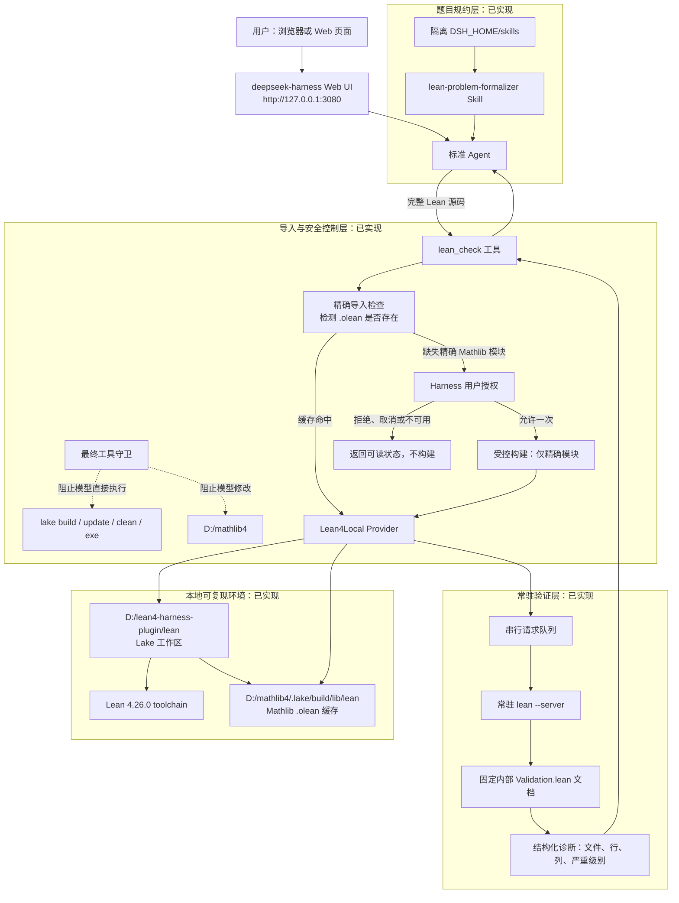
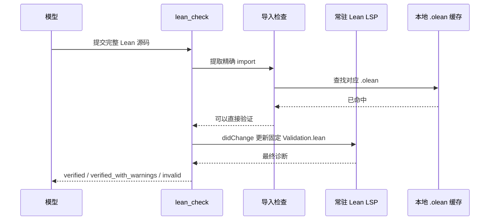
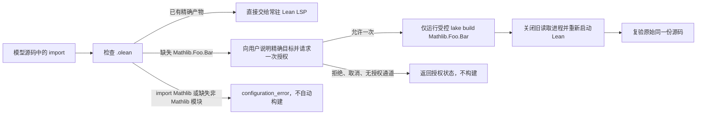
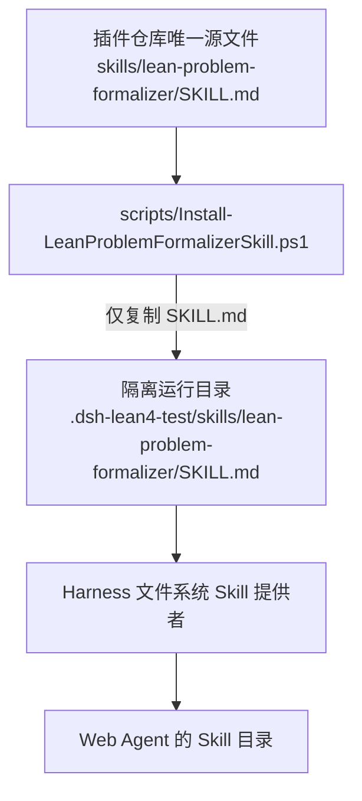
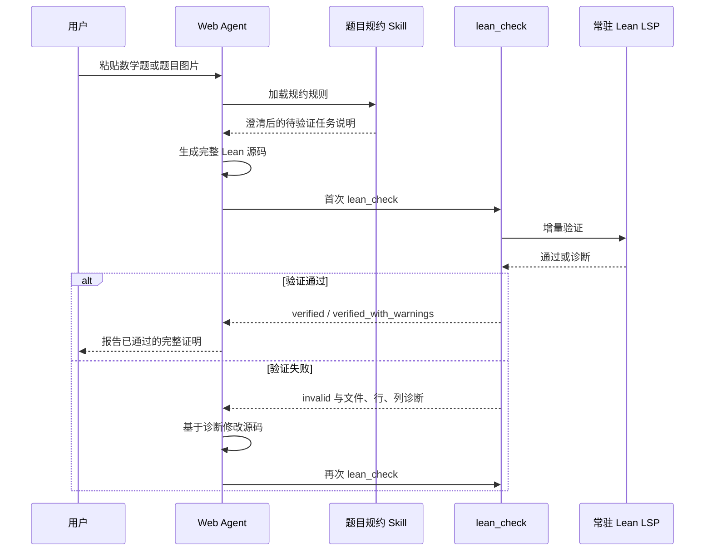
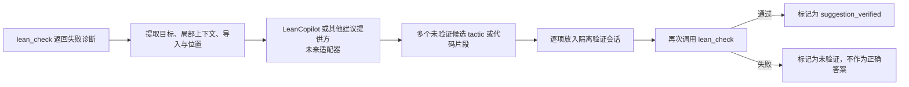

# Lean 4 Harness Plugin 架构说明

> 生成时间：2026-09-08 17:31:34<br>
> 作者：ygw<br>
> 适用环境：Windows 11、deepseek-harness、本地 Lean 4.26.0、Mathlib 4<br>
> 文档状态：当前实现与后续演进设计并列说明；每项能力均明确标注状态。



可编辑源文件：[202609081731_Lean4Harness插件架构图.svg](202609081731_Lean4Harness插件架构图.svg)。

## 1. 这套插件解决什么问题

它为 deepseek-harness 中的模型提供一条可信的 Lean 4 验证链路：模型负责生成 Lean 源码，Lean 编译器负责给出唯一权威的通过或失败结果。插件不会因为一段代码“看起来像证明”就声称成功。

完整闭环是：

```text
数学题 -> 题意规约 -> 模型生成 Lean 源码 -> lean_check -> Lean 诊断
                                                   |             |
                                                   |             +-> 通过：才可称证明完成
                                                   |
                                                   +-> 失败：模型依据行列诊断修正后再次验证
```

其中，题意规约和 Lean 验证是两项独立能力：

- `lean-problem-formalizer` Skill 负责把自然语言题目说清楚，防止题目中的量词、分数、指数、区间端点或 OCR 转写错误进入形式化代码。
- `lean_check` 负责验证最终生成的完整 Lean 源码，不能替代数学题意核对。

## 2. 当前总体架构



这张图强调两件最重要的事：

1. 模型从不直接拥有修改 Mathlib 或随意运行 Lake 的权限。
2. 正常验证只读取本地已有 `.olean`，然后发送 LSP 增量检查；它不是每次都执行 Mathlib 的全量构建。

## 3. 运行时职责分层

| 层级 | 主要组件 | 当前状态 | 职责与边界 |
| --- | --- | --- | --- |
| 交互层 | Web UI、标准 Agent | 已实现 | 接收用户题目、展示工具调用、将诊断反馈给模型。 |
| 题目规约层 | `lean-problem-formalizer` | 已实现 | 提取变量、量词、定义、假设与结论；核对图片/OCR/文本差异；生成“待 Lean 验证”的任务说明。 |
| 工具层 | `lean_check` | 已实现 | 接收完整源码与逻辑文件名，检查导入，调用验证服务，返回稳定状态和诊断。 |
| 导入控制层 | `.olean` 检查、授权服务 | 已实现 | 缓存命中时直接验证；仅在缺失精确 `Mathlib.*` 模块时向用户请求一次授权。 |
| 安全层 | `lean4-mathlib-guard` | 已实现 | 阻止模型工具运行 `lake build`、`lake update`、`lake clean`、`lake exe`，以及修改 `D:/mathlib4`。 |
| 验证服务层 | `Lean4Local`、`lean --server` | 已实现 | 维持一个常驻 Lean LSP 进程及固定内部文档，按序验证模型代码。 |
| 本地环境层 | `lean/`、Lean toolchain、Mathlib `.olean` | 已实现 | 提供锁定版本、Lake 环境和本地编译产物。 |
| 建议层 | LeanCopilot 适配器 | 尚未接入 | 未来只产生候选 tactic 或修复建议；任何候选仍必须经 `lean_check` 再验证。 |
| 自动修正层 | 有上限的“诊断 -> 建议 -> 验证”循环 | 尚未接入 | 未来可选能力，必须有次数、时长、成本和人工关闭边界。 |

## 4. 为什么验证不应反复构建 Mathlib

### 4.1 正常验证路径

每次模型调用 `lean_check` 时，服务会先读取源码中的普通 `import` 声明，并在已经解析的 Lean 搜索路径中检查对应 `.olean` 是否存在。命中后，源码会通过同一个常驻 Lean LSP 进程中的同一个 `Validation.lean` 文档进行增量更新。



这样做有三个收益：

- `lake env` 只在服务启动阶段用于取得 Lake 环境，不会在每次工具调用时重复运行。
- Lean 导入过的声明尽可能保留在同一 LSP 工作进程内，避免因不断创建新文档而重复加载大模块。
- 验证文档以 `dependencyBuildMode: "never"` 打开，模型提交的源码不能隐式触发依赖构建、缓存下载或远程访问。

### 4.2 为什么首次大模块仍可能较慢

完整 `.olean` 缓存避免的是**编译 Mathlib**，不是把所有模块提前放进 Lean LSP 的内存。第一次导入一个较大的分析、三角函数或代数模块时，LSP 仍需读取产物、解析依赖元数据并完成源码精化，因此可能超过两分钟。

当前隔离 Web profile 的时间配置是：

| 场景 | 限制 | 目的 |
| --- | ---: | --- |
| 前台 `lean_check`、Lean 启动、最终诊断 | 600 秒 | 为首次加载大型精确模块留出可用预算。 |
| 后台预热 | 90 秒 | 预热异常缓慢时不占用整段前台验证时间。 |
| 独立插件服务默认值 | 120 秒 | 独立库可由调用方通过 `requestTimeoutMs` 调整；隔离 Web profile 已覆盖为上述期限。 |

因此，看到首次大型导入耗时较长，并不等于它在重新下载或重构 Mathlib。应以 `lean_check` 的导入检查、Lake 输出和进程行为判断，而不是只根据等待时间判断。

## 5. 缺失模块的受控授权路径

当前本机 Mathlib 常用模块已恢复完整 `.olean` 缓存，正常情况下不应进入这一分支。它保留的目的，是处理将来版本变动、依赖变化或确实缺少的精确模块。



这条路径具备以下约束：

- 只能构建导入检查刚刚产生且尚未使用的精确 `Mathlib.*` 目标，不能让模型提交任意 Lake 参数。
- 用户审批的是一次明确列出的最小目标集，而非“允许构建全部 Mathlib”。
- 完成受控构建后，先关闭旧 Lean 读取进程，再验证同一源码，避免 Windows 下读取正在替换的 `.olean` 文件。
- 用户拒绝或无法授权时，系统返回状态而不是暗中继续构建。
- `import Mathlib` 不作为常规导入：本机没有独立可用的顶层 `Mathlib.olean`，而且聚合入口会带来不必要的加载成本。

## 6. 题目规约 Skill 的位置与作用

### 6.1 文件与部署关系



仓库中的 Skill 是唯一维护源。安装脚本会比较文件内容：目标不存在时安装；内容相同则不重复写入；内容不同则默认停止，只有明确传入 `-Force` 才覆盖。这避免在更新 Skill 时静默抹掉用户可能做过的运行期修改。

### 6.2 规约规则

Skill 在模型真正写 Lean 代码之前要求完成下列工作：

1. 明确变量的 Lean 类型、量词、函数定义、定义域、区间和结论。
2. 将“偶函数”“单调”“集合包含”等自然语言术语展开为 Lean 可表达的量化谓词。
3. 当题目来自图片、扫描件、PDF 与 OCR 文本时，优先核对指数、分数、符号、开闭区间端点和量词。
4. 题源不清、条件缺失或命题可疑时，向用户说明具体问题；不悄悄修改定理后冒充原题。
5. 要求模型使用最小精确 `Mathlib.*` 导入、避免 `import Mathlib`、生成完整代码并调用 `lean_check`。
6. 只有 `lean_check` 返回 `verified` 或 `verified_with_warnings` 后，模型才可称 Lean 证明完成。

当前已验证 Harness 能从隔离 `DSH_HOME/skills` 中发现该 Skill，来源类型为 `user-dsh`，且模型与用户均可调用。

## 7. 一次实际使用会如何流动



建议的用户操作是：

1. 在 `http://127.0.0.1:3080/` 新建对话。
2. 先说明“使用 `lean-problem-formalizer` 将下面题目整理为 Lean 4 验证任务”，然后粘贴题目或题图。
3. 核对模型给出的变量、假设、结论和题源修正说明；若不一致，在写代码前纠正。
4. 让模型生成完整 Lean 源码并调用 `lean_check`。
5. 只有看到明确的通过状态后，再把结果视为已验证证明。

## 8. 目录与部署边界

```text
D:/lean4-harness-plugin/
├── src/                                      独立插件基础服务与类型
├── lean/                                     本地 Lake 工作区、toolchain 与本地 Mathlib path 依赖
├── skills/lean-problem-formalizer/SKILL.md   通用题目规约 Skill 的唯一源文件
├── scripts/Install-LeanProblemFormalizerSkill.ps1
│                                               将 Skill 安全安装到隔离 Harness 主目录
├── .dsh-lean4-test/                          隔离 Web 运行期目录；已被 Git 忽略
│   └── skills/lean-problem-formalizer/        已部署的运行期 Skill 副本
└── .specstory/history/docs/                  进度、会话与架构文档

D:/deepseek-harness/deepseek-harness/
└── packages/experimental/
    ├── lean4/                                Lean 服务契约与类型
    ├── lean4-local/                          本地常驻 Lean LSP 提供方、导入检查与受控构建
    ├── tool-lean4/                           模型可调用的 lean_check 工具
    ├── lean4-mathlib-guard/                  对模型工具的最终 Mathlib 安全守卫
    └── lean4-profile/                        隔离 Web profile 的 Cordis 组合配置
```

这里有三个必须保持清晰的边界：

- 插件仓库保存可版本控制的源代码、Skill 与文档；运行期的会话、日志、缓存和凭据不提交。
- Mathlib 根目录 `D:/mathlib4` 是受保护的本地依赖；模型不能直接修改它。
- Lean profile 当前是实验性、隔离启用的 profile，不会自动修改 deepseek-harness 的默认 profile。

## 9. 返回状态如何理解

| 状态 | 含义 | 模型下一步应做什么 |
| --- | --- | --- |
| `verified` | Lean 没有阻断性错误且无警告。 | 可以声明验证通过。 |
| `verified_with_warnings` | Lean 通过，但存在警告。 | 说明证明通过并保留警告；必要时继续清理。 |
| `invalid` | 解析、类型检查、精化或证明失败。 | 依据结构化诊断修正源码后复验。 |
| `authorization_required` | 授权流程中的提示状态：缺失精确模块，需要用户批准。当前 Web 工具会等待用户决定后再返回终态。 | 等待用户决定，不能自行运行 Lake。 |
| `authorization_rejected` / `authorization_cancelled` | 用户拒绝或取消受控构建。 | 报告缺失模块，不构建。 |
| `authorization_unavailable` | 当前界面没有授权能力。 | 报告环境限制，不构建。 |
| `build_failed` | 已授权的最小受控构建失败。 | 返回 Lake 诊断，不宣称代码有误或已通过。 |
| `configuration_error` | 使用了不支持的导入、缺失非 Mathlib 依赖或配置不完整。 | 修正精确导入或部署配置；不触发自动构建。 |

## 10. LeanCopilot 的后续演进

LeanCopilot 当前**没有接入**；这是一项明确的设计边界。未来建议采用独立适配器，而不是让验证服务直接依赖某个未确认的外部协议。



接入时必须保持以下不变量：

- 建议服务从来不是证明器；只有 Lean 的实际验证结果能确认正确性。
- 每个候选必须带目标位置、上下文来源和再验证结果。
- 自动修正循环必须有最大轮次、总耗时与人工关闭开关，不能无限重试。
- 外部建议服务应有本地模拟测试，不能把线上服务可用性当作普通测试前提。

## 11. 当前已完成与下一阶段

### 已完成

- 本地 Lean 4.26.0 与本地 Mathlib 4 工作区接入。
- 常驻 `lean --server` LSP 验证、固定内部文档与串行检查队列。
- `lean_check` 模型工具、结构化诊断与十分钟前台验证预算。
- 精确 `.olean` 导入检查、缺失模块的一次性用户授权与受控最小构建。
- 模型侧 Lake/Mathlib 写入保护。
- 完整 Mathlib `.olean` 缓存恢复与实际本地回归验证。
- 通用题目规约 Skill、图片/OCR 题源核对规则和隔离 Web 自动发现。

### 推荐下一阶段

1. 为不同证明复杂度建立会话池、并发限制和资源上限，避免多个大型导入互相争抢资源。
2. 增加项目级验证与显式 tactic state 获取工具，让诊断不只停留在编译错误。
3. 定义 `LeanSuggestionProvider` 接口和离线模拟实现，再接入 LeanCopilot。
4. 在建议候选经过独立复验后，才逐步启用有限次数的自动修正闭环。
5. 待实验 profile 稳定后，再决定是否将其整合进更广泛的 Harness 发布配置。

## 12. 事实来源

本说明依据以下当前项目资料整理：

- `D:\lean4-harness-plugin\AGENTS.md`
- `D:\lean4-harness-plugin\README.md`
- `D:\lean4-harness-plugin\skills\lean-problem-formalizer\SKILL.md`
- `D:\lean4-harness-plugin\.specstory\history\docs\开发进度.md`
- `D:\deepseek-harness\deepseek-harness\packages\experimental\lean4-profile\cordis.patch.yml`
- `D:\deepseek-harness\deepseek-harness\packages\experimental\lean4-local\src\index.ts`
- `D:\deepseek-harness\deepseek-harness\packages\experimental\tool-lean4\src\index.ts`
- `D:\deepseek-harness\deepseek-harness\packages\experimental\lean4-mathlib-guard\src\index.ts`

若实现发生变化，应同时更新本文件、`D:\lean4-harness-plugin\README.md` 和 `D:\lean4-harness-plugin\.specstory\history\docs\开发进度.md`。
