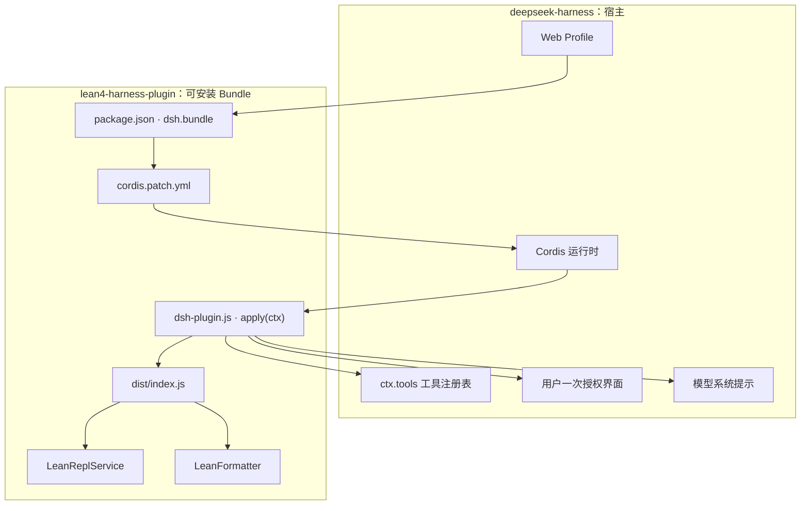
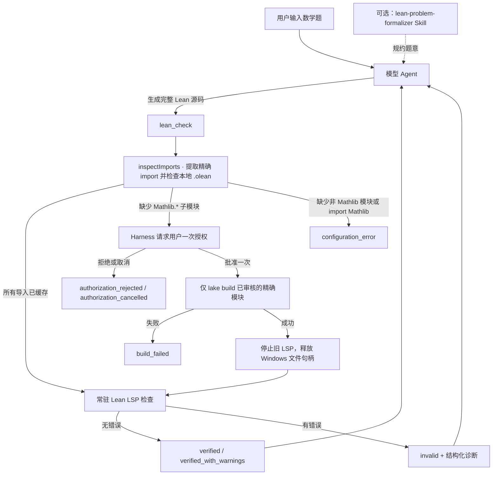
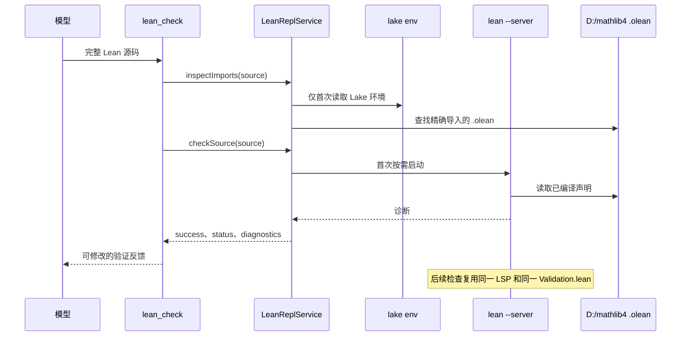

# Lean 4 Harness Plugin 架构说明

> 作者：ygw
>
> 当前发行版：`0.1.1`；当前实现：Windows 11、Lean 4.26.0、Mathlib 4、deepseek-harness `0.1.3-alpha.2`。
> 本文只描述当前已实现的架构与运行边界。

## 一句话定义

`lean4-harness-plugin` 是一个可安装的 deepseek-harness Bundle。它向模型提供 Lean 4 的可信外部反馈，使模型形成下面的验证闭环：

```text
生成 Lean 代码 → 调用 lean_check → 接收 Lean 诊断 → 修改代码 → 再验证
```

Lean 实际检查结果是唯一的正确性依据。

## 两层架构：Harness 宿主与独立插件

deepseek-harness 不维护第二份 Lean 验证实现。它负责加载 Profile、调度模型工具、呈现用户授权和管理会话；Lean 相关核心由本仓库维护。



加载关系是固定的：

1. `package.json` 的 `dsh.bundle.patch` 声明 `cordis.patch.yml`；
2. Profile 安装包后，Harness 将 patch 叠加进配置树；
3. patch 插入 `lean4-harness-plugin/dsh`；
4. Harness 通过 `package.json` 的导出映射加载根目录 `dsh-plugin.js`；
5. `dsh-plugin.js` 导出 `apply(ctx)`，在 Cordis 生命周期中创建服务并注册工具；
6. 它直接导入仓库构建产物 `dist/index.js`，避免在 Harness 源码目录维护复制版逻辑。

`src/index.ts` 是 TypeScript 验证核心的公共 API，供其他 TypeScript 宿主嵌入；它**不是** DSH 运行时入口。对于 deepseek-harness，入口始终是根目录 `dsh-plugin.js`。

## 源码、构建产物与运行状态

```text
GitHub / 源码仓库                   本机构建或运行状态
────────────────────────────────   ─────────────────────────────────
package.json                        dist/（npm run build 生成）
cordis.patch.yml                    Profile 配置树中的 Bundle layer
dsh-plugin.js                       Cordis 已加载的插件实例
src/                                LeanReplService 的常驻进程状态
lean/                               lean/.lake/ 与临时 Validation.lean
skills/                             DSH_HOME/skills 中已安装的可选 Skill
scripts/                            .dsh-lean4-*/ 中的本机 Profile / 日志
```

`node_modules/`、`lean/.lake/`、临时 LSP 会话和 `.dsh-*` Profile 都是本机生成物，不提交到 GitHub。`dist/` 由 TypeScript 构建生成，但作为固定 Commit 的受控运行产物提交到 GitHub；这使 DSH STORE 无需运行任何第三方安装或构建脚本即可定位 `dist/index.js`。每次修改 `src/` 后，必须重新构建、测试并提交同步的 `dist/` 文件。

## 当前验证闭环（已实现）



具体流程：

1. 模型调用 `lean_check(source, file_name)`；
2. 服务从源码提取去重后的显式 `import`，只读取 Lake 解析出的搜索路径中的 `.olean`；
3. 缓存命中时，源码会提交到同一个常驻 Lean LSP 的内部 `Validation.lean`；
4. 调用者给出的 `file_name` 仅用于展示诊断，不会为每次检查新建文件或新开 Lean 进程；
5. Lean 无错误才返回 `verified` 或 `verified_with_warnings`；有错误则返回 `invalid` 和文件、行、列、严重级别、消息；
6. 模型应依据诊断修改源码并再次调用 `lean_check`。

## 常驻 Lean LSP 与缓存策略（已实现）



默认 `prewarm: false`。这意味着启动 Web Profile 时不立即加载 Mathlib；首次 `lean_check` 才按需启动 Lean。首次大型导入可能慢，但它读取的是本地 `.olean`，不是 Mathlib 全量构建。之后 `reusedProcess: true` 表示服务复用了常驻进程。

内部验证文档以 `dependencyBuildMode: "never"` 打开，因此普通检查不能触发 `lake update`、远程缓存下载或隐式依赖构建。

## 导入补齐与安全边界（已实现）

所有模型代码、文件名和导入都属于不可信输入。构建边界如下：

| 场景 | 插件行为 |
| --- | --- |
| 精确 `Mathlib.*` 模块已有 `.olean` | 直接验证，不请求授权。 |
| 精确 `Mathlib.*` 模块缺失 | 向用户说明模块名；仅一次批准后才构建。 |
| 缺失的不是 `Mathlib.*` | 返回 `configuration_error`，永不构建。 |
| 顶层 `import Mathlib` | 不作为可授权的精确构建目标。 |
| 调用方复制或篡改检查对象 | 服务拒绝；构建目标必须与原始检查快照和对象身份一致。 |
| 模型直接运行 Lake 构建命令 | 最终工具守卫拒绝。 |
| 模型写入 Mathlib 根目录 | 最终工具守卫拒绝。 |

即使用户批准，服务也只以参数数组执行等价于 `lake build <精确 Mathlib 模块>` 的受控命令。它不接受模型自由拼接 Lake 命令，不执行全量 Mathlib 构建，也不执行 `lake update`、`lake clean` 或 `lake exe`。

## 本地环境边界（已实现）

`lean/` 是插件的 Lake 工作区，不是 Python 虚拟环境。当前工作区锁定：

```text
Lean：    leanprover/lean4:v4.26.0
Mathlib：D:/mathlib4（本地 path dependency）
```

`lean/lakefile.lean` 当前明确引用 `D:/mathlib4`。安装 Bundle 不会下载 Lean 或 Mathlib；另一台电脑必须自行准备版本匹配的 Lean 4 与 Mathlib 4，并在 Mathlib 路径不同的情况下修改 Lake 配置。

Bundle 的 `mathlibRoot` 配置决定写入守卫的保护范围，但不能替代 Lake 的 path dependency。两处路径必须保持一致。

## 模型工具与用户体验（已实现）

| 工具 | 面向谁 | 建议使用方式 |
| --- | --- | --- |
| `lean_check` | 所有 Lean 证明任务 | 每次产生完整第一版或修改版源码后调用。 |
| `lean_repl_request` | 高级 LSP / JSON 行调试 | 普通证明不要调用，优先 `lean_check`。 |
| `lean_format_tactic_state` | 目标状态展示和后续建议适配 | 将原始 tactic state 转为结构化目标和 Markdown。 |

插件的系统提示要求模型：选择最小精确 Mathlib 导入；完成前调用 `lean_check`；不使用顶层 `import Mathlib` 作为默认导入；不直接执行 Lake 维护命令；不修改 Mathlib。

`lean-problem-formalizer` 是随仓库提供、但需要通过脚本安装到 `DSH_HOME/skills` 的**可选** Skill。它规约题意，不负责验证，也不会自动替代 `lean_check`。

## Bundle 配置和生命周期（已实现）

关键配置如下：

```yaml
config:
  workspaceRoot: 'D:/lean4-harness-plugin/lean' # 可选；默认使用包内 lean/
  mathlibRoot: 'D:/mathlib4'                    # 应与 lakefile.lean 一致
  lakeCommand: 'lake'
  leanCommand: 'lean'
  requestTimeoutMs: 600000
  buildTimeoutMs: 600000
  prewarm: false
  prewarmSource: |
    import Mathlib.Data.Nat.Basic
```

`requestTimeoutMs` 与 `buildTimeoutMs` 默认都是 600,000 毫秒，以避免旧 120 秒前台工具政策在首次大型导入时过早终止。`prewarm: true` 会把首次精确导入成本转移到 Profile 启动阶段；默认 `false` 则延迟到首个 `lean_check`。

Profile 加载时 Cordis 调用 `apply(ctx)`；工具、系统提示和守卫通过 Context 注册。Profile 停止或插件卸载时，`ctx.effect` 调用服务 `stop()`，关闭 Lean 进程并清理临时会话。修改 TypeScript 源码或 `dist/` 后重启 Profile 即可；修改 `package.json` 或 `cordis.patch.yml` 后需要移除并重新安装 Bundle。
