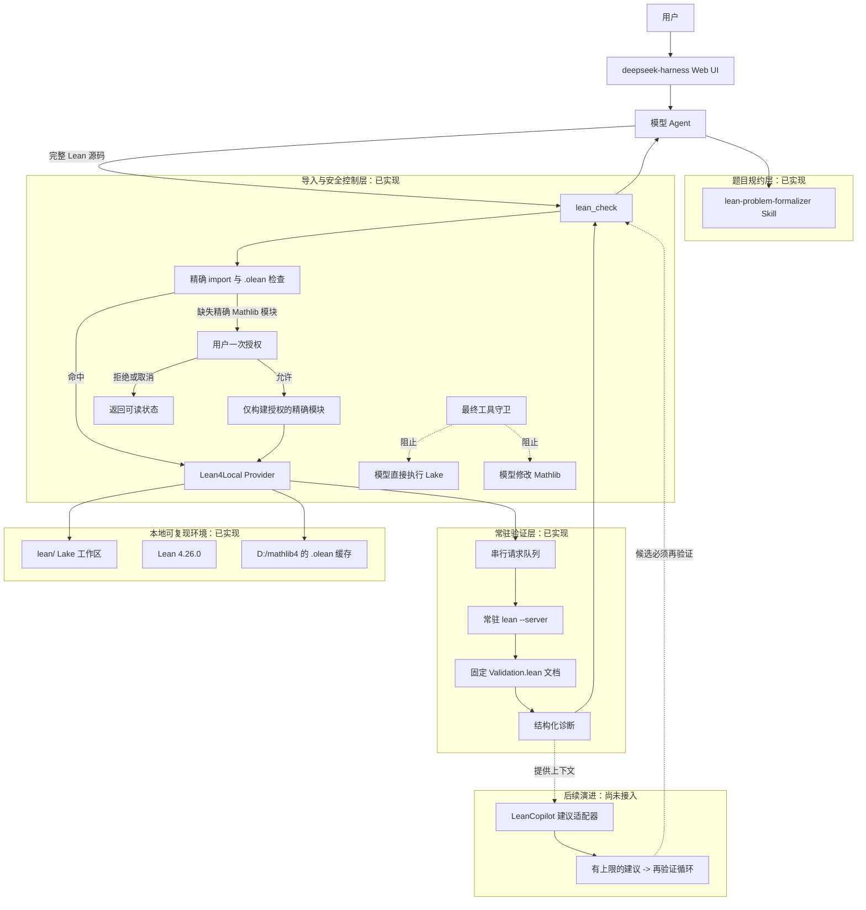

# Lean 4 Harness Plugin 架构说明

> 作者：ygw
> 适用环境：Windows 11、deepseek-harness、本地 Lean 4.26.0、Mathlib 4
> 状态：当前实现与后续演进设计均明确标注。

## 目标

本插件让 `deepseek-harness` 中的模型能够获得 Lean 4 的可信反馈：模型生成源码，Lean 编译器/LSP 给出唯一权威的验证结果。插件不会因代码“看起来正确”而把证明标记为成功。

## 当前验证闭环

1. 用户输入数学题，模型可先借助 `lean-problem-formalizer` 规约变量、量词、定义、假设和结论。
2. 模型生成完整 Lean 4 源码，并调用 `lean_check`。
3. 插件检查源码中的精确 `import` 是否在本地已有对应 `.olean`。
4. 缓存命中时，源码会提交给同一个常驻 Lean LSP 进程的固定内部文档，以增量方式获得诊断。
5. Lean 验证通过才返回 `verified` 或 `verified_with_warnings`；失败则返回结构化的文件、行、列、严重级别和原始诊断，供模型修改后再次验证。

正常验证不会重新下载或全量构建 Mathlib。常驻服务通过已经解析的 Lake 环境读取本地 `.olean`，并且内部文档使用 `dependencyBuildMode: "never"`，阻止临时验证触发依赖构建、远程缓存访问或下载。

## 缺失模块与授权边界

只有缺少明确的 `Mathlib.*` 子模块时，集成层才会向用户展示模块和精确构建目标，并请求一次授权。用户批准后，只允许构建该授权目标和 Lake 的必要依赖，服务重启后再验证原始源码。

以下情况均不会触发构建：用户拒绝或取消、授权通道不可用、缺失的不是 Mathlib 子模块，以及使用顶层聚合导入 `import Mathlib`。模型也被最终工具守卫阻止直接运行 `lake build`、`lake update`、`lake clean`、`lake exe` 或修改 `D:/mathlib4`。

## 组件职责

| 组件 | 当前状态 | 职责 |
| --- | --- | --- |
| `lean-problem-formalizer` | 已实现 | 忠实规约自然语言题目，核对图片、OCR 与文本中的符号差异。 |
| `lean_check` | 已实现 | 调用导入检查与常驻验证服务，返回稳定状态及结构化诊断。 |
| `LeanReplService` | 已实现 | 管理 Lean 子进程、超时、请求关联、LSP/JSON 行兼容模式和会话清理。 |
| `LeanFormatter` | 已实现 | 格式化诊断与 tactic state，输出便于模型继续处理的 Markdown。 |
| Mathlib 访问控制 | 已实现 | 优先复用本地 `.olean`，对缺失的精确模块执行用户授权的最小构建。 |
| LeanCopilot 适配器 | 尚未接入 | 未来只提供候选 tactic 或修正建议，不能替代 Lean 验证。 |
| 自动修正闭环 | 尚未接入 | 未来在次数、时间、成本与人工关闭开关的限制下执行。 |

## LeanCopilot 的后续原则

LeanCopilot 输出始终只是候选建议。后续接入将通过独立的建议提供者接口，与 `lean_check` 解耦；候选会在独立会话中重新验证，只有通过 Lean 的候选才可能标记为可靠结果。建议服务不可用、超时或返回空内容时，基础验证能力仍可单独工作。

## 本地与 GitHub 的边界

- GitHub 仓库保存可复用的源码、配置、脚本、README、测试、Skill 和本文件。
- `.specstory/` 保存本机开发过程、会话记录和工作草稿，已被 `.gitignore` 排除，不会上传。
- `node_modules/`、`dist/`、`lean/.lake/` 和临时 Lean 验证会话也只保留在本机。
